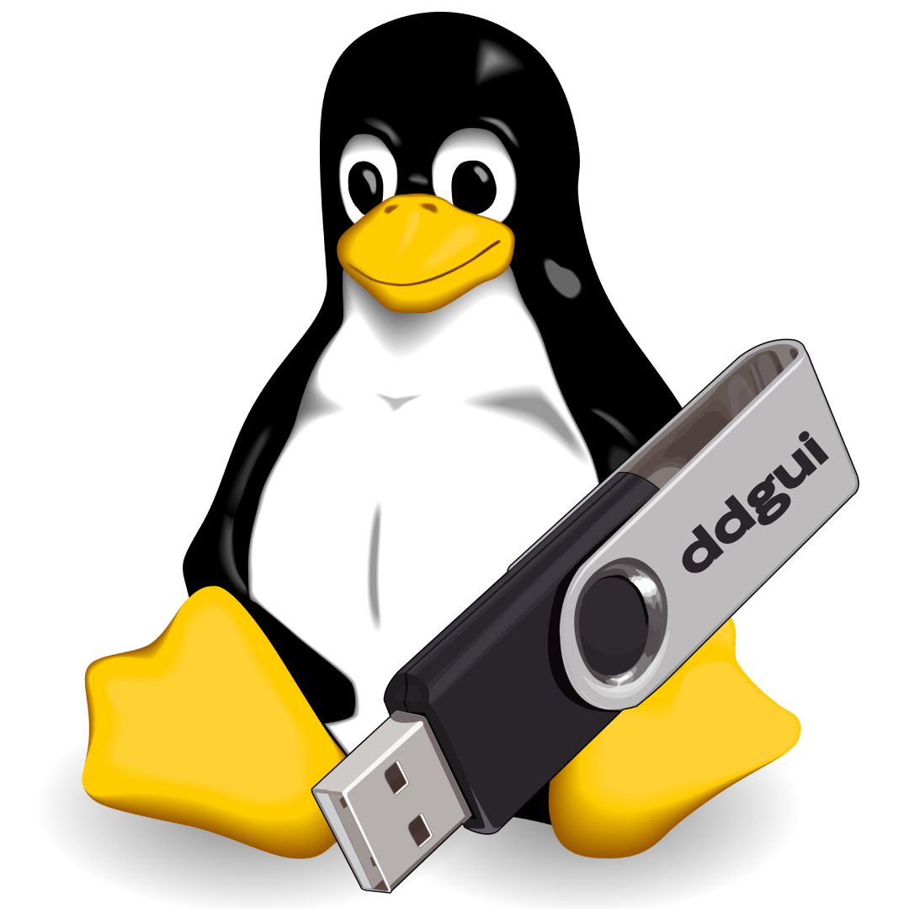
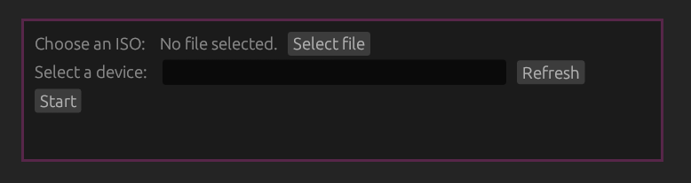

<div align="center">



[](#)
[](https://opensource.org/licenses/MIT)

# ddgui

**ddgui** is a GUI frontend for dd to create bootable USB flash drives or Live USBs.



</div>

## Installation

### Using cargo

To build and install using cargo, run:

```
sudo make install
```

Make sure you have all the dependencies installed:

- Rust
- Cargo
- GNU Make
- dd

## Usage

Invoke the program as root:

```
sudo ddgui
```

The UI should be intuitive and easy to use.